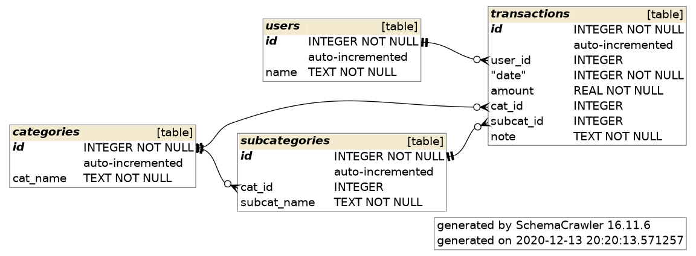
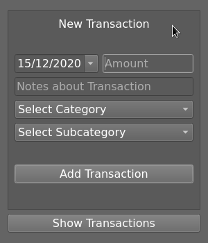
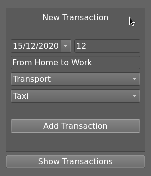
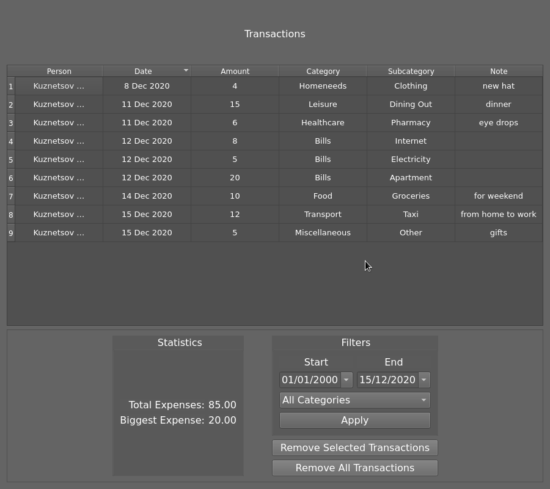
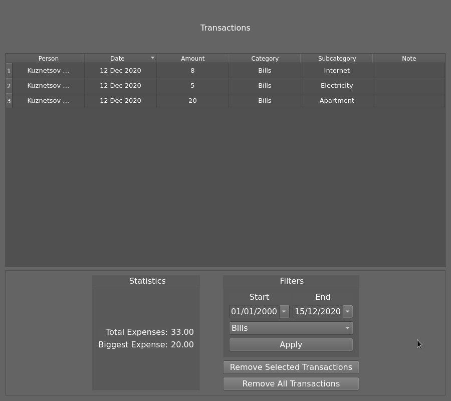

# Задача

В рамках курса "Современные информационные технологии обработки и хранения данных" было создано приложение для отслеживания расходов пользователя. Менеджер расходов реализован на языке С++ с использованием библиотеки Qt. Используемая база данных - `SQLite`. Для работы с базой данных используются библиотеки `sqlite_orm` и Qt. `Catch2` - для тестирования.

# База данных

Менеджер расходов предназначен для отслеживания расходов пользователя. Расходы поделены на категории и подкатегории. Структура базы данных:

1. Пользователи - используют программу для отслеживания своих расходов.
    - Уникальный идентификатор
    - Имя пользователя

2. Категории расходов - каждая транзакция принадлежит к определенной категории.
    - Уникальный идентификатор
    - Название категории

3. Подкатегории расходов - уточняет принадлежность расходов внутри определенной категории.
    - Уникальный идентификатор
    - Идентификатор категории
    - Название подкатегории

4. Транзакции - представляет описание расходов.
    - Уникальный идентификатор
    - Идентификатор пользователя
    - Дата транзакции
    - Количество потраченных средств
    - Идентификатор категории
    - Идентификатор подкатегории
    - Описание транзакции

# ER-диаграмма

# Основные функции

1. Добавление новой транзакции.
    - Пользователь выбирает дату расхода, количество потраченных средств, категорию и подкатегорию.
    - Невозможно добавить новую транзакцию, если количество потраченных средств не указано.
    - Невозможно добавить новую транзакцию, если не указана основная категория.
    - Если не указана подкатегория, то по умолчанию выбирается подкатегория "Other".

2. Просмотр списка всех транзакций.
    - Все транзакции выводятся в табличке.
    - Транзакции можно отсортировать любым образом (по дате, по расходам, по категории и так далее).
    - Возможно удаление выделенных транзакций.
    - Возможно удаление сразу всех транзакций.

3. Фильтрация списка транзакций.
    - Можно выбрать определенную категорию, тогда будут показаны только транзакции этой категории.
    - Можно выбрать период времени, тогда будут показаны только транзакции, совершенные в этот период.

4. Статистика совершенных расходов.
    - Вывод общей суммы всех потраченных средств.
    - Вывод максимальной потраченной суммы за один раз.
    - Статистика показана с учетом заданных фильтров (категория и период времени).

# Доступные категории и подкатегории расходов

- Bills
    - Phone
    - Electricity
    - Internet
    - Apartment
    - Water
    - Other

- Food
    - Groceries
    - Other

- Leisure
    - Dining Out
    - Movies
    - Other

- Homeneeds
    - Clothing
    - Furnishing
    - Other

- Transport
    - Public
    - Taxi
    - Other

- Healthcare
    - Pharmacy
    - Dental
    - Other

- Miscellaneous
    - Other

# Скриншоты

## Добавление новой транзакции

## Просмотр списка транзакций

## Просмотр конкретных транзакций

